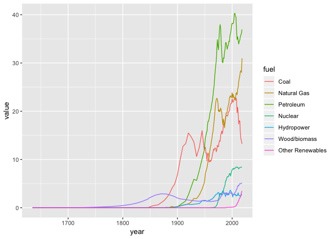
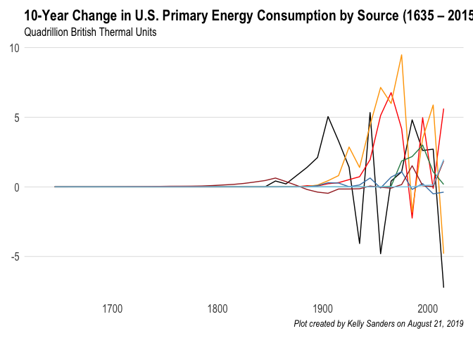
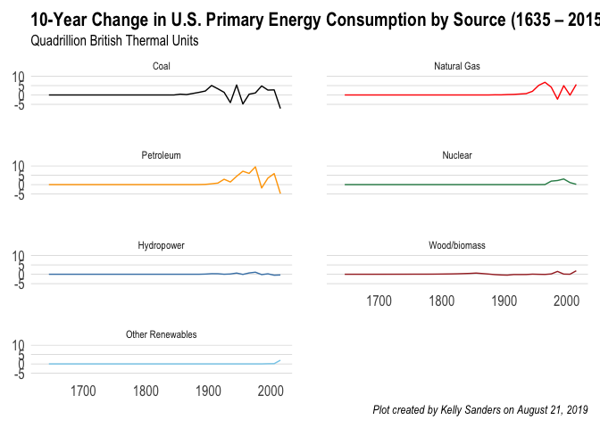
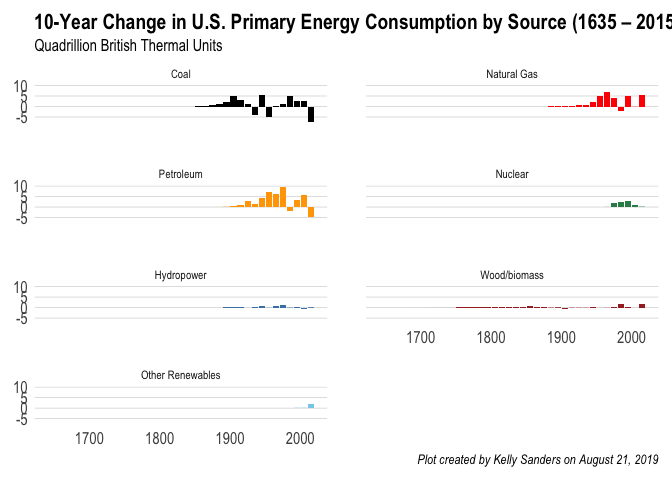

Using R, create a plot of primary energy consumption (Quadrillion) versus time from 1635 -2017.

## Read in CSV file

In base R, you can read in data as "dataframes" very easily. However, I would like to get you all in the habit of using "data tables" from the "data.table" library. It's great for later on (should you continue to use R for data analysis) when you will likely encounter larger datasets. Data tables are much more time-efficient to process on than dataframes.

First, let's install the package:

```r
# install.packages("data.table")
```
Then, we can load the data.table library:

```r
library(data.table)
```

Let's now read in the CSV file. If you open the file itself, you can see that the first two rows are not actually data we need. We can specify our code to skip the first two rows.

```r
df_data = fread('data/Primary Energy Consumption_from 1635.csv', skip = 2)
```

Click on the *df_data* object in your work environment to view the entire data table, or run the following code to see the "head" (first 6 rows) of the data table:

```r
head(df_data)
```

```
##      V1 Coal Natural Gas Petroleum Total Fossil Nuclear Hydropower
## 1: 1635    0          NA        NA            0      NA         NA
## 2: 1645   NA          NA        NA            0      NA         NA
## 3: 1655   NA          NA        NA            0      NA         NA
## 4: 1665   NA          NA        NA            0      NA         NA
## 5: 1675   NA          NA        NA            0      NA         NA
## 6: 1685   NA          NA        NA            0      NA         NA
##    Wood/biomass Solar Wind Total Renewable Energy
## 1:           NA    NA   NA                  0.000
## 2:        0.001    NA   NA                  0.001
## 3:        0.002    NA   NA                  0.002
## 4:        0.005    NA   NA                  0.005
## 5:        0.007    NA   NA                  0.007
## 6:        0.009    NA   NA                  0.009
```

## Rename year column

The first column, which includes the years, was not assigned a column name since the CSV file does not have a column name in that cell. So, we can manually change the first column as such:

```r
colnames(df_data)[1] = 'year'
head(df_data)
```

```
##    year Coal Natural Gas Petroleum Total Fossil Nuclear Hydropower
## 1: 1635    0          NA        NA            0      NA         NA
## 2: 1645   NA          NA        NA            0      NA         NA
## 3: 1655   NA          NA        NA            0      NA         NA
## 4: 1665   NA          NA        NA            0      NA         NA
## 5: 1675   NA          NA        NA            0      NA         NA
## 6: 1685   NA          NA        NA            0      NA         NA
##    Wood/biomass Solar Wind Total Renewable Energy
## 1:           NA    NA   NA                  0.000
## 2:        0.001    NA   NA                  0.001
## 3:        0.002    NA   NA                  0.002
## 4:        0.005    NA   NA                  0.005
## 5:        0.007    NA   NA                  0.007
## 6:        0.009    NA   NA                  0.009
```

## Fill NA values

There are a lot of records that are null (NA). Let's set these as equal to zero:

```r
df_data[is.na(df_data)] = 0 
```

## Create new column that's a sum of other columns

Let's create a new column titled 'Other Renewables' that is a sum of Solar and Wind fuel consumption.

```r
df_data[, 'Other Renewables' := Solar + Wind]
tail(df_data)
```

```
##    year     Coal Natural Gas Petroleum Total Fossil  Nuclear Hydropower
## 1: 2013 18.03863    26.80513  34.49957     79.34333 8.244433   2.562382
## 2: 2014 17.99763    27.38283  34.76349     80.14396 8.337559   2.466577
## 3: 2015 15.54887    28.19110  35.47761     79.21757 8.336886   2.321177
## 4: 2016 14.22590    28.40035  35.81663     78.44289 8.426753   2.472442
## 5: 2017 13.83746    28.03423  36.17359     78.04528 8.418968   2.766969
## 6: 2018 13.24134    30.96481  36.94527     81.15142 8.441226   2.687652
##    Wood/biomass    Solar     Wind Total Renewable Energy Other Renewables
## 1:     4.848354 0.224524 1.601359               9.236619         1.825883
## 2:     4.994208 0.337412 1.727542               9.525739         2.064954
## 3:     4.983358 0.426621 1.777306               9.508462         2.203927
## 4:     5.020163 0.570008 2.095595              10.158208         2.665603
## 5:     5.084265 0.776888 2.342890              10.971012         3.119778
## 6:     5.127819 0.951353 2.533131              11.299955         3.484484
```

## Transform data

When plotting a time series of categorical data, it's often easiest to have your data in a "long" format instead of a "wide" format (like above). So, this next step will transform your data so that all the values for the different fuel types will be put into a single column. Another column labeled "Fuel" will specify the type of fuel.


```r
df_long = melt(df_data, id.vars = "year", measure.vars = c(2:12),
               variable.name = "fuel", value.name = "value")
head(df_long)
```

```
##    year fuel value
## 1: 1635 Coal     0
## 2: 1645 Coal     0
## 3: 1655 Coal     0
## 4: 1665 Coal     0
## 5: 1675 Coal     0
## 6: 1685 Coal     0
```

## Remove certain variables 

Let's remove rows where the fuel are the totals ("Total Fossil", "Total Renewable Energy") as well as "Solar" and "Wind" since they're already included in the "Other Renewables" variable. 
The *%in%* selects all rows where the "Fuel" column included in the vector *c("Total Fossil", "Total Renewable Energy", "Solar", "Wind")*. The exclamation point (!) is equivalent to a *not* in the code. Thus, the code is actually selecting all rows where the fuel does NOT equal the listed fuels: 

```r
df_fuels = df_long[! fuel %in% c("Total Fossil", "Total Renewable Energy", "Solar", "Wind")]
```

Alternatively, you can specify the rows with the fuel types you **do** want to keep:

```r
df_fuels = df_long[ fuel %in% c("Coal", "Natural Gas", "Petroleum", "Nuclear", "Hydropower", "Wood/biomass", "Other Renewables")]
```
You can see that the resulting data table are the same either way.

## Create plot of primary fuel consumption over time

### Load ggplot
*ggplot* is a very popular package in R used to create plots. It's incredible versatile and flexible, and we'll be using the package to create the plot.
First, let's install the package:

```r
# install.packages("ggplot2")
```


```r
library(ggplot2)
```
### Rough plotting

```r
plot_cons = ggplot(data = df_fuels, aes(x = year, y = value, color = fuel)) + geom_line()
plot_cons
```

<!-- -->

### Change axes limits and range

Let's change the title, labels, and axes of the plot.

```r
plot_cons = plot_cons + 
  scale_x_continuous(limits = c(1635,2018), breaks = seq(1600,2000,50), expand = c(0,0)) +
  scale_y_continuous(limits = c(0,45), breaks = seq(0,45,5)) 
plot_cons
```

<!-- -->

### Specify line colors

```r
plot_cons = plot_cons + scale_color_manual(values = c("Petroleum" = "orange",
                                              "Natural Gas" = "red",
                                              "Coal" = "black",
                                              "Nuclear" = "seagreen",
                                              "Hydropower" = "steelblue",
                                              "Wood/biomass" = "brown",
                                              "Other Renewables" = "skyblue"))
plot_cons
```

<!-- -->

### Add title, subtitle, and caption
Be sure to change Prof. Sanders' name to your own and to change the date as well.

```r
plot_cons = plot_cons + labs(title = "U.S. Primary Energy Consumption by Source (1635 – 2018)", 
                     subtitle = "Quadrillion British Thermal Units",
                     caption = "Plot created by Kelly Sanders on August 21, 2019",
                     x = NULL,
                     y = NULL,
                     color = NULL) 
plot_cons
```

<!-- -->

### Making the plot prettier

I'm not a huge fan of how the plot looks right now, so let's pretty it up a bit, shall we? First up, let's make it a more minimal plot and change the font to Arial Narrow:

```r
  plot_cons = plot_cons + theme_minimal(base_family = "Arial Narrow")
  plot_cons
```

<!-- -->

Better but can still be improved. Let's change the font sizes and styles a bit.

```r
  plot_cons = plot_cons + theme(plot.title = element_text(size = 16, face = "bold"),
                        plot.subtitle = element_text(size = 12, face = "plain"),
                        plot.caption = element_text(size = 10, face = "italic"),
                        axis.title = element_text(size = 14, face = "bold"),
                        axis.text = element_text(size = 12, face = "plain"),
                        legend.text = element_text(size = 12, face = "plain"))
  plot_cons
```

<!-- -->

Okay, now let's get rid of some of the grid lines so that there's only a y-axis line.

```r
  plot_cons = plot_cons + theme(panel.grid = element_line(color = "#cccccc", size = 0.2),
                        panel.grid.major = element_line(color = "#cccccc", size = 0.2),
                        panel.grid.major.x = element_blank(),
                        panel.grid.minor = element_blank(),
                        plot.margin = margin(10, 10, 10, 10),
                        panel.spacing = grid::unit(2, "lines")) 
  plot_cons
```

<!-- -->

### Saving the line plot as an image file

To see where your current working directory is, use the *getwd()* function (usually, if you're running this notebook in RStudio, it should already be the location where the notebook is saved on your computer:

```r
getwd()
```

```
## [1] "/Users/MEAS/GitHub/ene215-fall2019/01/R"
```

If that's not where you want your image files to be saved, you can use the *setwd()* function to change it. 

To save the plot (in the sub-folder named "figs"):

```r
  ggsave(plot_cons, 
         path = "figs",
         filename = "Figure_Fuel-Consumption-by-Source_KTSanders.png", 
         width = 8.2, 
         height = 4.4, 
         dpi = 600)
```
Be sure to change the filename to your own.


### Removing the legend completely

This next step isn't very necessary, but let's say you don't like having a legend there, and instead you want the fuel source labels to be directly next to the line plot. To do so, first load the following the libraries:

```r
library(directlabels)
library(grid)
```


```r
  plot_cons_cut = plot_cons + 
    geom_dl(aes(label = fuel), method = list(dl.trans(x = x + .3), "last.bumpup", cex = 0.8)) +
    guides(color = FALSE) +     
    theme(plot.margin = margin(10, 110, 10, 10))
```

The following chunk cuts the plot and adds labels on top

```r
  plot_cons_cut = ggplotGrob(plot_cons_cut)
  plot_cons_cut$layout$clip[plot_cons_cut$layout$name == "panel"] = "off"
  # grid.draw(plot_cons_cut)
```

We can save the new plot: 

```r
  ggsave(plot_cons_cut, 
         path = "figs",
         filename = "Figure_Fuel-Consumption-by-Source_KTSanders_V2.png", 
         width = 8.2, 
         height = 4.4, 
         dpi = 400)
```


## Data analysis

### General analysis

We can play around with the data to do some rough analyses.
First, let's see which fuel and year had the highest value of annual fuel consumption:

```r
df_fuels[, .SD[which.max(value)]]
```

```
##    year      fuel    value
## 1: 2005 Petroleum 40.28278
```
So, the largest amount of fuel consumption (in units of quadrillion BTUs) was petroleum consumption in the year 2005. 

But what if we want to know the maximum amount (and the corresponding year) consumed *for each fuel type*? Luckily, we can easily group our function to find the max:

```r
df_fuels[, .SD[which.max(value)], by = 'fuel']
```

```
##                fuel year     value
## 1:             Coal 2005 22.796543
## 2:      Natural Gas 2018 30.964810
## 3:        Petroleum 2005 40.282775
## 4:          Nuclear 2007  8.458589
## 5:       Hydropower 1997  3.640458
## 6:     Wood/biomass 2018  5.127819
## 7: Other Renewables 2018  3.484484
```
We can see that coal consumption peaked in 2005, whereas consumption of natural gas and non-hydro renewables peaked just last year in 2018.

Let's sum up fuel consumption every year, across all fuel types:


```r
agg_annual = df_fuels[, .(value = sum(value)), by = year] # sum fuel consumption by year
```

When was our primary fuel consumption the greatest? Just last year in 2018, it seems.

```r
agg_annual[, .SD[which.max(value)]]
```

```
##    year    value
## 1: 2018 100.8926
```
In fact, over the past 10 years, our total primary fuel consumption has been increasing.

```r
tail(agg_annual, 10)
```

```
##     year     value
##  1: 2009  93.73072
##  2: 2010  97.31806
##  3: 2011  96.59958
##  4: 2012  94.10274
##  5: 2013  96.82439
##  6: 2014  98.00726
##  7: 2015  97.06292
##  8: 2016  97.02785
##  9: 2017  97.43526
## 10: 2018 100.89260
```

But we can see from the plots we created that coal consumption has been on the decline, while natural gas and non-hydro consumption have been increasing.

### 10-year changes

To create a calculation of rate of change every 10 years, let's create a sequence of years that we want to include. In this case, we're going to create a 10 year sequence from 1635 to 2015.

```r
# year_seq = seq(max(df_fuels[, year]), min(df_fuels[, year]), -10)
year_seq = seq(min(df_fuels[, year]), max(df_fuels[, year]), 10)
year_seq
```

```
##  [1] 1635 1645 1655 1665 1675 1685 1695 1705 1715 1725 1735 1745 1755 1765
## [15] 1775 1785 1795 1805 1815 1825 1835 1845 1855 1865 1875 1885 1895 1905
## [29] 1915 1925 1935 1945 1955 1965 1975 1985 1995 2005 2015
```

Create a new data table to include only those years:

```r
agg_10yr = df_fuels[year %in% year_seq]
head(agg_10yr)
```

```
##    year fuel value
## 1: 1635 Coal     0
## 2: 1645 Coal     0
## 3: 1655 Coal     0
## 4: 1665 Coal     0
## 5: 1675 Coal     0
## 6: 1685 Coal     0
```

Let's make a new column telling us what the span of years are. Intuitively, we know the years are 10 years apart. 

```r
agg_10yr[, prev_year := year-10]
agg_10yr[, span := paste(prev_year, year, sep = " - ")]
head(agg_10yr)
```

```
##    year fuel value prev_year        span
## 1: 1635 Coal     0      1625 1625 - 1635
## 2: 1645 Coal     0      1635 1635 - 1645
## 3: 1655 Coal     0      1645 1645 - 1655
## 4: 1665 Coal     0      1655 1655 - 1665
## 5: 1675 Coal     0      1665 1665 - 1675
## 6: 1685 Coal     0      1675 1675 - 1685
```

Calculate the difference and percent difference between each row and the row before it, grouped by fuel type.

```r
agg_10yr[ , diff := value - shift(value), by = fuel]    
agg_10yr[ , perc_diff := (value - shift(value))/shift(value), by = fuel]    
head(agg_10yr)
```

```
##    year fuel value prev_year        span diff perc_diff
## 1: 1635 Coal     0      1625 1625 - 1635   NA        NA
## 2: 1645 Coal     0      1635 1635 - 1645    0       NaN
## 3: 1655 Coal     0      1645 1645 - 1655    0       NaN
## 4: 1665 Coal     0      1655 1655 - 1665    0       NaN
## 5: 1675 Coal     0      1665 1665 - 1675    0       NaN
## 6: 1685 Coal     0      1675 1675 - 1685    0       NaN
```

Some of the columns are unncessary, so let's just clean up the data table a bit:

```r
agg_10yr = agg_10yr[, c("fuel", "span", "year", "value", "diff", "perc_diff")]
head(agg_10yr)
```

```
##    fuel        span year value diff perc_diff
## 1: Coal 1625 - 1635 1635     0   NA        NA
## 2: Coal 1635 - 1645 1645     0    0       NaN
## 3: Coal 1645 - 1655 1655     0    0       NaN
## 4: Coal 1655 - 1665 1665     0    0       NaN
## 5: Coal 1665 - 1675 1675     0    0       NaN
## 6: Coal 1675 - 1685 1685     0    0       NaN
```

What was the greatest (maximum) change in absolute value of quadrillion BTUs consumed over a ten year span? 

```r
agg_10yr[!is.na(diff), .SD[which.max(diff)]]
```

```
##         fuel        span year    value     diff perc_diff
## 1: Petroleum 1965 - 1975 1975 32.73232 9.486643 0.4081035
```
Between 1965 and 1975, petroleum consumption increased by almost 9.5 quadrillion BTUs (amounting to a 41% change).

Okay, but what if we want to know what was the greatest absolute change in fuel consumption *for each fuel type*? 

```r
agg_10yr[!is.na(diff), .SD[which.max(diff)], by = 'fuel']
```

```
##                fuel        span year     value     diff perc_diff
## 1:             Coal 1935 - 1945 1945 15.972000 5.338000 0.5019748
## 2:      Natural Gas 1955 - 1965 1965 15.768667 6.770732 0.7524762
## 3:        Petroleum 1965 - 1975 1975 32.732323 9.486643 0.4081035
## 4:          Nuclear 1985 - 1995 1995  7.075436 2.999873 0.7360635
## 5:       Hydropower 1965 - 1975 1975  3.154607 1.095530 0.5320491
## 6:     Wood/biomass 2005 - 2015 2015  4.983358 1.869428 0.6003436
## 7: Other Renewables 2005 - 2015 2015  2.203927 1.967946 8.3394256
```
We can see that coal experienced the greatest absolute growth in the years 1935 - 1945. Non-hydro renewables experienced the greatest growth in consumption from 2005 to 2015.

On the other hand, we can also when the most drastic decreases in fuel consumption was by singling out rows with a negative difference, then finding the minimum.

```r
agg_10yr[!is.na(diff) & diff < 0, .SD[which.min(diff)], by = fuel]
```

```
##            fuel        span year     value      diff  perc_diff
## 1:         Coal 2005 - 2015 2015 15.548870 -7.247673 -0.3179286
## 2:  Natural Gas 1975 - 1985 1985 17.703482 -2.244401 -0.1125132
## 3:    Petroleum 2005 - 2015 2015 35.477609 -4.805166 -0.1192859
## 4:   Hydropower 1995 - 2005 2005  2.702942 -0.502365 -0.1567291
## 5: Wood/biomass 1895 - 1905 1905  1.843000 -0.463000 -0.2007806
```
Coal experienced the biggest drop in absolute fuel consumption within the past decade, with an over 7 quadrillion decrease (~32% decrease). 

We can analyze percentage differences (difference relative to the original year) as well. For starters, let's look at when each fuel type experienced the greatest percent increase:

```r
agg_10yr[is.finite(perc_diff), .SD[which.max(perc_diff)], by = 'fuel']
```

```
##                fuel        span year    value     diff  perc_diff
## 1:             Coal 1865 - 1875 1875 1.440000 0.808000   1.278481
## 2:      Natural Gas 1895 - 1905 1905 0.372000 0.225000   1.530612
## 3:        Petroleum 1885 - 1895 1895 0.168000 0.128000   3.200000
## 4:          Nuclear 1965 - 1975 1975 1.899798 1.856634  43.013483
## 5:       Hydropower 1895 - 1905 1905 0.386000 0.296000   3.288889
## 6:     Wood/biomass 1655 - 1665 1665 0.005000 0.003000   1.500000
## 7: Other Renewables 1985 - 1995 1995 0.100863 0.100692 588.842105
```
Now, our results have changed a bit. Because we're using a percent difference, the data is skewed towards earlier years where there wasn't much fuel consumed (within each fuel type) anyways. For example, non-hydro renewables experienced a 588% increase in fuel consumption between 1985 - 1995 That can seem like a lot, but when you look at how in 1995, only 0.100863 quadrillion BTUs of non-hydro renewable was consumed, it's still a very small amount. 

What if we want to see the most drastic percent decrease?

```r
agg_10yr[is.finite(perc_diff) & perc_diff < 0, .SD[which.min(perc_diff)], by = fuel]
```

```
##            fuel        span year     value      diff  perc_diff
## 1:         Coal 2005 - 2015 2015 15.548870 -7.247673 -0.3179286
## 2:  Natural Gas 1975 - 1985 1985 17.703482 -2.244401 -0.1125132
## 3:    Petroleum 2005 - 2015 2015 35.477609 -4.805166 -0.1192859
## 4:   Hydropower 1995 - 2005 2005  2.702942 -0.502365 -0.1567291
## 5: Wood/biomass 1895 - 1905 1905  1.843000 -0.463000 -0.2007806
```

## Plotting percent changes

### Line plot


```r
line_diff = ggplot(data = agg_10yr, aes(x = year, y = diff, color = fuel, group = fuel)) + 
  geom_line() +
  labs(title = "10-Year Change in U.S. Primary Energy Consumption by Source (1635 – 2015)", 
       subtitle = "Quadrillion British Thermal Units",
       caption = "Plot created by Kelly Sanders on August 21, 2019",
       x = NULL,
       y = NULL) +
  scale_color_manual(values = c("Petroleum" = "orange",
                               "Natural Gas" = "red",
                               "Coal" = "black",
                               "Nuclear" = "seagreen",
                               "Hydropower" = "steelblue",
                               "Wood/biomass" = "brown",
                               "Other Renewables" = "skyblue")) +
  guides(color = FALSE) +
  theme_minimal(base_family = "Arial Narrow") +
  theme(plot.title = element_text(size = 16, face = "bold"),
        plot.subtitle = element_text(size = 12, face = "plain"),
        plot.caption = element_text(size = 10, face = "italic"),
        axis.title = element_text(size = 14, face = "bold"),
        axis.text = element_text(size = 12, face = "plain"),
        legend.text = element_text(size = 12, face = "plain"),
        panel.grid = element_line(color = "#cccccc", size = 0.2),
        panel.grid.major = element_line(color = "#cccccc", size = 0.2),
        panel.grid.major.x = element_blank(),
        panel.grid.minor = element_blank(),
        plot.margin = margin(10, 10, 10, 10),
        panel.spacing = grid::unit(2, "lines"))
line_diff
```

```
## Warning: Removed 7 rows containing missing values (geom_path).
```

<!-- -->


```r
line_diff_facet = ggplot(data = agg_10yr, aes(x = year, y = diff, color = fuel, group = fuel)) + 
  geom_line() +
  facet_wrap(~fuel, ncol = 2) +
  labs(title = "10-Year Change in U.S. Primary Energy Consumption by Source (1635 – 2015)", 
       subtitle = "Quadrillion British Thermal Units",
       caption = "Plot created by Kelly Sanders on August 21, 2019",
       x = NULL,
       y = NULL) +
  scale_color_manual(values = c("Petroleum" = "orange",
                                "Natural Gas" = "red",
                                "Coal" = "black",
                                "Nuclear" = "seagreen",
                                "Hydropower" = "steelblue",
                                "Wood/biomass" = "brown",
                                "Other Renewables" = "skyblue")) +
  guides(color = FALSE) +
  theme_minimal(base_family = "Arial Narrow") +
  theme(plot.title = element_text(size = 16, face = "bold"),
        plot.subtitle = element_text(size = 12, face = "plain"),
        plot.caption = element_text(size = 10, face = "italic"),
        axis.title = element_text(size = 14, face = "bold"),
        axis.text = element_text(size = 12, face = "plain"),
        legend.text = element_text(size = 12, face = "plain"),
        panel.grid = element_line(color = "#cccccc", size = 0.2),
        panel.grid.major = element_line(color = "#cccccc", size = 0.2),
        panel.grid.major.x = element_blank(),
        panel.grid.minor = element_blank(),
        plot.margin = margin(10, 10, 10, 10),
        panel.spacing = grid::unit(2, "lines"))
line_diff_facet
```

```
## Warning: Removed 7 rows containing missing values (geom_path).
```

<!-- -->

### Bar plots


```r
bar_diff_facet = ggplot(data = agg_10yr, aes(x = year, y = diff, fill = fuel, group = fuel)) + 
  geom_bar(stat = "identity") +
  facet_wrap(~fuel, ncol = 2) +
  labs(title = "10-Year Change in U.S. Primary Energy Consumption by Source (1635 – 2015)", 
       subtitle = "Quadrillion British Thermal Units",
       caption = "Plot created by Kelly Sanders on August 21, 2019",
       x = NULL,
       y = NULL,
       color = NULL) +
  scale_fill_manual(values = c("Petroleum" = "orange",
                                "Natural Gas" = "red",
                                "Coal" = "black",
                                "Nuclear" = "seagreen",
                                "Hydropower" = "steelblue",
                                "Wood/biomass" = "brown",
                                "Other Renewables" = "skyblue")) +
  guides(fill = FALSE) +
  theme_minimal(base_family = "Arial Narrow") +
  theme(plot.title = element_text(size = 16, face = "bold"),
        plot.subtitle = element_text(size = 12, face = "plain"),
        plot.caption = element_text(size = 10, face = "italic"),
        axis.title = element_text(size = 14, face = "bold"),
        axis.text = element_text(size = 12, face = "plain"),
        legend.text = element_text(size = 12, face = "plain"),
        panel.grid = element_line(color = "#cccccc", size = 0.2),
        panel.grid.major = element_line(color = "#cccccc", size = 0.2),
        panel.grid.major.x = element_blank(),
        panel.grid.minor = element_blank(),
        plot.margin = margin(10, 10, 10, 10),
        panel.spacing = grid::unit(2, "lines"))
bar_diff_facet
```

```
## Warning: Removed 7 rows containing missing values (position_stack).
```

<!-- -->

