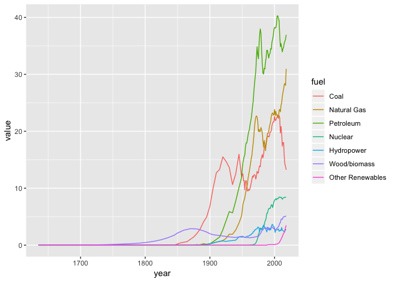
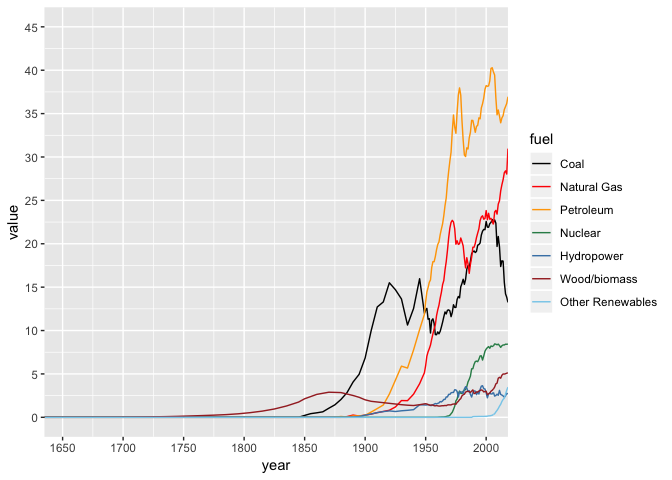
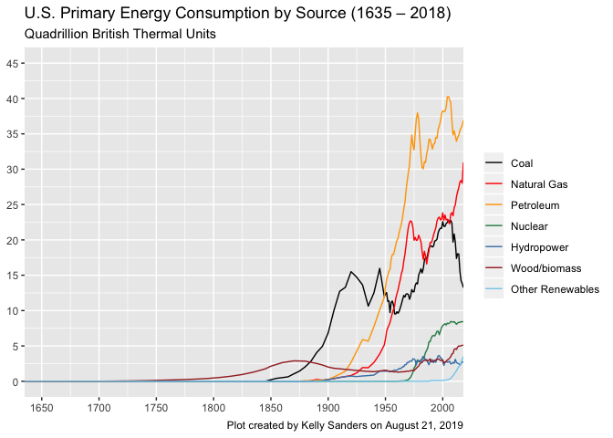
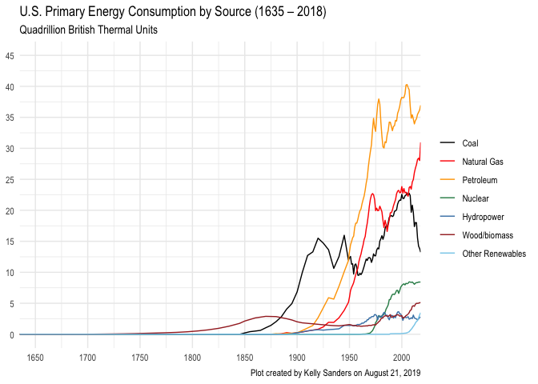
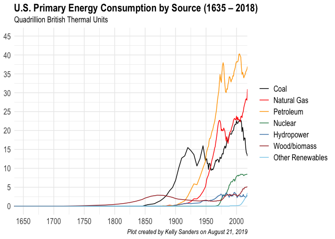
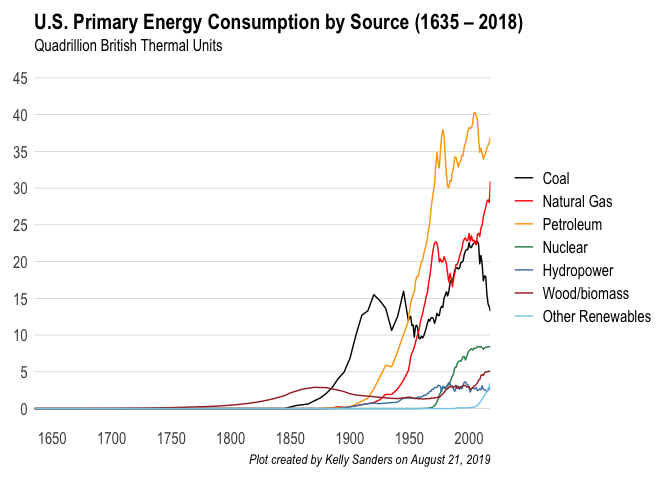

This is an [R Markdown](http://rmarkdown.rstudio.com) Notebook. When you execute code within the notebook, the results appear beneath the code. 

Try executing this chunk by clicking the *Run* button within the chunk or by placing your cursor inside it and pressing *Cmd+Shift+Enter*. 


```r
# plot(cars)
```

Add a new chunk by clicking the *Insert Chunk* button on the toolbar or by pressing *Cmd+Option+I*.

When you save the notebook, an HTML file containing the code and output will be saved alongside it (click the *Preview* button or press *Cmd+Shift+K* to preview the HTML file). 

The preview shows you a rendered HTML copy of the contents of the editor. Consequently, unlike *Knit*, *Preview* does not run any R code chunks. Instead, the output of the chunk when it was last run in the editor is displayed.


# Energy Transitions R Tutorial

Using R, create a plot of primary energy consumption (Quadrillion) versus time from 1635 -2017.

## Read in CSV file

In base R, you can read in data as "dataframes" very easily. However, I would like to get you all in the habit of using "data tables" from the "data.table" library. It's great for later on (should you continue to use R for data analysis) when you will likely encounter larger datasets. Data tables are much more time-efficient to process on than dataframes.

First, let's install the package:

```r
# install.packages("data.table")
```
Then, we can load the data.table library:

```r
library(data.table)
```

Let's now read in the CSV file. If you open the file itself, you can see that the first two rows are not actually data we need. We can specify our code to skip the first two rows.

```r
df_data = fread('data/Primary Energy Consumption_from 1635.csv', skip = 2)
```

Click on the *df_data* object in your work environment to view the entire data table, or run the following code to see the "head" (first 6 rows) of the data table:

```r
head(df_data)
```

```
##      V1 Coal Natural Gas Petroleum Total Fossil Nuclear Hydropower
## 1: 1635    0          NA        NA            0      NA         NA
## 2: 1645   NA          NA        NA            0      NA         NA
## 3: 1655   NA          NA        NA            0      NA         NA
## 4: 1665   NA          NA        NA            0      NA         NA
## 5: 1675   NA          NA        NA            0      NA         NA
## 6: 1685   NA          NA        NA            0      NA         NA
##    Wood/biomass Solar Wind Total Renewable Energy
## 1:           NA    NA   NA                  0.000
## 2:        0.001    NA   NA                  0.001
## 3:        0.002    NA   NA                  0.002
## 4:        0.005    NA   NA                  0.005
## 5:        0.007    NA   NA                  0.007
## 6:        0.009    NA   NA                  0.009
```

## Rename year column

The first column, which includes the years, was not assigned a column name since the CSV file does not have a column name in that cell. So, we can manually change the first column as such:

```r
colnames(df_data)[1] = 'year'
head(df_data)
```

```
##    year Coal Natural Gas Petroleum Total Fossil Nuclear Hydropower
## 1: 1635    0          NA        NA            0      NA         NA
## 2: 1645   NA          NA        NA            0      NA         NA
## 3: 1655   NA          NA        NA            0      NA         NA
## 4: 1665   NA          NA        NA            0      NA         NA
## 5: 1675   NA          NA        NA            0      NA         NA
## 6: 1685   NA          NA        NA            0      NA         NA
##    Wood/biomass Solar Wind Total Renewable Energy
## 1:           NA    NA   NA                  0.000
## 2:        0.001    NA   NA                  0.001
## 3:        0.002    NA   NA                  0.002
## 4:        0.005    NA   NA                  0.005
## 5:        0.007    NA   NA                  0.007
## 6:        0.009    NA   NA                  0.009
```

## Fill NA values

There are a lot of records that are null (NA). Let's set these as equal to zero:

```r
df_data[is.na(df_data)] = 0 
```

## Create new column that's a sum of other columns

Let's create a new column titled 'Other Renewables' that is a sum of Solar and Wind fuel consumption.

```r
df_data[, 'Other Renewables' := Solar + Wind]
tail(df_data)
```

```
##    year     Coal Natural Gas Petroleum Total Fossil  Nuclear Hydropower
## 1: 2013 18.03863    26.80513  34.49957     79.34333 8.244433   2.562382
## 2: 2014 17.99763    27.38283  34.76349     80.14396 8.337559   2.466577
## 3: 2015 15.54887    28.19110  35.47761     79.21757 8.336886   2.321177
## 4: 2016 14.22590    28.40035  35.81663     78.44289 8.426753   2.472442
## 5: 2017 13.83746    28.03423  36.17359     78.04528 8.418968   2.766969
## 6: 2018 13.24134    30.96481  36.94527     81.15142 8.441226   2.687652
##    Wood/biomass    Solar     Wind Total Renewable Energy Other Renewables
## 1:     4.848354 0.224524 1.601359               9.236619         1.825883
## 2:     4.994208 0.337412 1.727542               9.525739         2.064954
## 3:     4.983358 0.426621 1.777306               9.508462         2.203927
## 4:     5.020163 0.570008 2.095595              10.158208         2.665603
## 5:     5.084265 0.776888 2.342890              10.971012         3.119778
## 6:     5.127819 0.951353 2.533131              11.299955         3.484484
```

## Transform data

When plotting a time series of categorical data, it's often easiest to have your data in a "long" format instead of a "wide" format (like above). So, this next step will transform your data so that all the values for the different fuel types will be put into a single column. Another column labeled "Fuel" will specify the type of fuel.


```r
df_long = melt(df_data, id.vars = "year", measure.vars = c(2:12),
               variable.name = "fuel", value.name = "value")
head(df_long)
```

```
##    year fuel value
## 1: 1635 Coal     0
## 2: 1645 Coal     0
## 3: 1655 Coal     0
## 4: 1665 Coal     0
## 5: 1675 Coal     0
## 6: 1685 Coal     0
```

## Remove certain variables 

Let's remove rows where the fuel are the totals ("Total Fossil", "Total Renewable Energy") as well as "Solar" and "Wind" since they're already included in the "Other Renewables" variable. 
The *%in%* selects all rows where the "Fuel" column included in the vector *c("Total Fossil", "Total Renewable Energy", "Solar", "Wind")*. The exclamation point (!) is equivalent to a *not* in the code. Thus, the code is actually selecting all rows where the fuel does NOT equal the listed fuels: 

```r
df_fuels = df_long[! fuel %in% c("Total Fossil", "Total Renewable Energy", "Solar", "Wind")]
```

Alternatively, you can specify the rows with the fuel types you **do** want to keep:

```r
df_fuels = df_long[ fuel %in% c("Coal", "Natural Gas", "Petroleum", "Nuclear", "Hydropower", "Wood/biomass", "Other Renewables")]
```
You can see that the resulting data table are the same either way.

## Create plot of primary fuel consumption over time

### Load ggplot
*ggplot* is a very popular package in R used to create plots. It's incredible versatile and flexible, and we'll be using the package to create the plot.
First, let's install the package:

```r
# install.packages("ggplot2")
```


```r
library(ggplot2)
```
### Rough plotting

```r
lplot = ggplot(data = df_fuels, aes(x = year, y = value, color = fuel)) + geom_line()
lplot
```

<!-- -->

### Change axes limits and range

Let's change the title, labels, and axes of the plot.

```r
lplot = lplot + 
  scale_x_continuous(limits = c(1635,2018), breaks = seq(1600,2000,50), expand = c(0,0)) +
  scale_y_continuous(limits = c(0,45), breaks = seq(0,45,5)) 
lplot
```

<!-- -->

### Specify line colors

```r
lplot = lplot + scale_color_manual(values = c("Petroleum" = "orange",
                                              "Natural Gas" = "red",
                                              "Coal" = "black",
                                              "Nuclear" = "seagreen",
                                              "Hydropower" = "steelblue",
                                              "Wood/biomass" = "brown",
                                              "Other Renewables" = "skyblue"))
lplot
```

<!-- -->

### Add title, subtitle, and caption
Be sure to change Prof. Sanders' name to your own and to change the date as well.

```r
lplot = lplot + labs(title = "U.S. Primary Energy Consumption by Source (1635 – 2018)", 
                     subtitle = "Quadrillion British Thermal Units",
                     caption = "Plot created by Kelly Sanders on August 21, 2019",
                     x = NULL,
                     y = NULL,
                     color = NULL) 
lplot
```

<!-- -->

### Making the plot prettier

I'm not a huge fan of how the plot looks right now, so let's pretty it up a bit, shall we? First up, let's make it a more minimal plot and change the font to Arial Narrow:

```r
  lplot = lplot + theme_minimal(base_family = "Arial Narrow")
  lplot
```

<!-- -->

Better but can still be improved. Let's change the font sizes and styles a bit.

```r
  lplot = lplot + theme(plot.title = element_text(size = 16, face = "bold"),
                        plot.subtitle = element_text(size = 12, face = "plain"),
                        plot.caption = element_text(size = 10, face = "italic"),
                        axis.title = element_text(size = 14, face = "bold"),
                        axis.text = element_text(size = 12, face = "plain"),
                        legend.text = element_text(size = 12, face = "plain"))
  lplot
```

<!-- -->

Okay, now let's get rid of some of the grid lines so that there's only a y-axis line.

```r
  lplot = lplot + theme(panel.grid = element_line(color = "#cccccc", size = 0.2),
                        panel.grid.major = element_line(color = "#cccccc", size = 0.2),
                        panel.grid.major.x = element_blank(),
                        panel.grid.minor = element_blank(),
                        plot.margin = margin(10, 10, 10, 10),
                        panel.spacing = grid::unit(2, "lines")) 
  lplot
```

<!-- -->

### Removing the legend completely

This next step isn't very necessary, but let's say you don't like having a legend there, and instead you want the fuel source labels to be directly next to the line plot. To do so, first load the following the libraries:

```r
library(directlabels)
library(grid)
```


```r
  lplot_cut = lplot + 
    geom_dl(aes(label = fuel), method = list(dl.trans(x = x + .3), "last.bumpup", cex = 0.8)) +
    guides(color = FALSE) +     
    theme(plot.margin = margin(10, 110, 10, 10))
```

The following chunk cuts the plot and adds labels on top

```r
  lplot_cut = ggplotGrob(lplot_cut)
  lplot_cut$layout$clip[lplot_cut$layout$name == "panel"] = "off"
  # grid.draw(lplot_cut)
```


### Saving plots

To see where your current working directory is, use the *getwd()* function (usually, if you're running this notebook in RStudio, it should already be the location where the notebook is saved on your computer:

```r
getwd()
```

```
## [1] "/Users/MEAS/GitHub/ene215-fall2019/01"
```

If that's not where you want your image files to be saved, you can use the *setwd()* function to change it. 

To save the plot (in the sub-folder named "figs"):

```r
  ggsave(lplot, 
         path = "figs",
         filename = "Figure_Fuel-Consumption-by-Source_KTSanders.png", 
         width = 8.2, 
         height = 4.4, 
         dpi = 600)
```
Be sure to change the filename to your own.


```r
  ggsave(lplot_cut, 
         path = "figs",
         filename = "Figure_Fuel-Consumption-by-Source_KTSanders_V2.png", 
         width = 8.2, 
         height = 4.4, 
         dpi = 400)
```


## Data analysis

### General analysis

We can play around with the data to do some rough analyses.
First, let's see which fuel and year had the highest value of annual fuel consumption:

```r
df_fuels[, .SD[which.max(value)]]
```

```
##    year      fuel    value
## 1: 2005 Petroleum 40.28278
```
So, the largest amount of fuel consumption (in units of quadrillion BTUs) was petroleum consumption in the year 2005. 

But what if we want to know the maximum amount (and the corresponding year) consumed *for each fuel type*? Luckily, we can easily group our function to find the max:

```r
df_fuels[, .SD[which.max(value)], by = 'fuel']
```

```
##                fuel year     value
## 1:             Coal 2005 22.796543
## 2:      Natural Gas 2018 30.964810
## 3:        Petroleum 2005 40.282775
## 4:          Nuclear 2007  8.458589
## 5:       Hydropower 1997  3.640458
## 6:     Wood/biomass 2018  5.127819
## 7: Other Renewables 2018  3.484484
```
We can see that coal consumption peaked in 2005, whereas consumption of natural gas and non-hydro renewables peaked just last year in 2018.

Let's sum up fuel consumption every year, across all fuel types:


```r
agg_annual = df_fuels[, .(value = sum(value)), by = year] # sum fuel consumption by year
```

When was our primary fuel consumption the greatest? Just last year in 2018, it seems.

```r
agg_annual[, .SD[which.max(value)]]
```

```
##    year    value
## 1: 2018 100.8926
```
In fact, over the past 10 years, our total primary fuel consumption has been increasing.

```r
tail(agg_annual, 10)
```

```
##     year     value
##  1: 2009  93.73072
##  2: 2010  97.31806
##  3: 2011  96.59958
##  4: 2012  94.10274
##  5: 2013  96.82439
##  6: 2014  98.00726
##  7: 2015  97.06292
##  8: 2016  97.02785
##  9: 2017  97.43526
## 10: 2018 100.89260
```

But we can see from the table below (as well as the plots we created) that coal consumption has been on the decline, while natural gas and non-hydro consumption have been increasing.

```r
tail(df_data, 10)
```

```
##     year     Coal Natural Gas Petroleum Total Fossil  Nuclear Hydropower
##  1: 2009 19.69121    23.41594  34.86021     77.96736 8.355220   2.668824
##  2: 2010 20.83397    24.57475  35.41577     80.82449 8.434433   2.538541
##  3: 2011 19.65778    24.95454  34.72671     79.33904 8.268698   3.102852
##  4: 2012 17.37823    26.08858  33.93858     77.40539 8.061822   2.628702
##  5: 2013 18.03863    26.80513  34.49957     79.34333 8.244433   2.562382
##  6: 2014 17.99763    27.38283  34.76349     80.14396 8.337559   2.466577
##  7: 2015 15.54887    28.19110  35.47761     79.21757 8.336886   2.321177
##  8: 2016 14.22590    28.40035  35.81663     78.44289 8.426753   2.472442
##  9: 2017 13.83746    28.03423  36.17359     78.04528 8.418968   2.766969
## 10: 2018 13.24134    30.96481  36.94527     81.15142 8.441226   2.687652
##     Wood/biomass    Solar     Wind Total Renewable Energy Other Renewables
##  1:     3.940009 0.078178 0.721129               7.408140         0.799307
##  2:     4.505882 0.091282 0.923427               8.059132         1.014709
##  3:     4.608932 0.112429 1.167636               8.991849         1.280065
##  4:     4.507805 0.158961 1.340059               8.635527         1.499020
##  5:     4.848354 0.224524 1.601359               9.236619         1.825883
##  6:     4.994208 0.337412 1.727542               9.525739         2.064954
##  7:     4.983358 0.426621 1.777306               9.508462         2.203927
##  8:     5.020163 0.570008 2.095595              10.158208         2.665603
##  9:     5.084265 0.776888 2.342890              10.971012         3.119778
## 10:     5.127819 0.951353 2.533131              11.299955         3.484484
```

### 10-year changes

To create a calculation of rate of change every 10 years, let's create a sequence of years that we want to include. In this case, we're going to move backwards every 10 years from the most recent year to the earliest year:

```r
year_seq = seq(max(df_fuels[, year]), min(df_fuels[, year]), -10)
year_seq
```

```
##  [1] 2018 2008 1998 1988 1978 1968 1958 1948 1938 1928 1918 1908 1898 1888
## [15] 1878 1868 1858 1848 1838 1828 1818 1808 1798 1788 1778 1768 1758 1748
## [29] 1738 1728 1718 1708 1698 1688 1678 1668 1658 1648 1638
```

Create a new data table to include only those years:

```r
agg_10yr = df_fuels[year %in% year_seq]
head(agg_10yr)
```

```
##    year fuel     value
## 1: 1958 Coal  9.533287
## 2: 1968 Coal 12.330677
## 3: 1978 Coal 13.765575
## 4: 1988 Coal 18.846312
## 5: 1998 Coal 21.655744
## 6: 2008 Coal 22.387437
```

Let's make a new column telling us what the span of years are. Intuitively, we know the years are 10 years apart. 

```r
agg_10yr[, prev_year := year-10]
agg_10yr[, span := paste(prev_year, year, sep = " - ")]
head(agg_10yr)
```

```
##    year fuel     value prev_year        span
## 1: 1958 Coal  9.533287      1948 1948 - 1958
## 2: 1968 Coal 12.330677      1958 1958 - 1968
## 3: 1978 Coal 13.765575      1968 1968 - 1978
## 4: 1988 Coal 18.846312      1978 1978 - 1988
## 5: 1998 Coal 21.655744      1988 1988 - 1998
## 6: 2008 Coal 22.387437      1998 1998 - 2008
```

Calculate the difference and percent difference between each row and the row before it, grouped by fuel type.

```r
agg_10yr[ , diff := value - shift(value), by = fuel]    
agg_10yr[ , perc_diff := (value - shift(value))/shift(value), by = fuel]    
head(agg_10yr)
```

```
##    year fuel     value prev_year        span     diff  perc_diff
## 1: 1958 Coal  9.533287      1948 1948 - 1958       NA         NA
## 2: 1968 Coal 12.330677      1958 1958 - 1968 2.797390 0.29343394
## 3: 1978 Coal 13.765575      1968 1968 - 1978 1.434898 0.11636814
## 4: 1988 Coal 18.846312      1978 1978 - 1988 5.080737 0.36909007
## 5: 1998 Coal 21.655744      1988 1988 - 1998 2.809432 0.14907065
## 6: 2008 Coal 22.387437      1998 1998 - 2008 0.731693 0.03378748
```

Some of the columns are unncessary, so let's just clean up the data table a bit:

```r
agg_10yr = agg_10yr[, c("fuel", "span", "value", "diff", "perc_diff")]
head(agg_10yr)
```

```
##    fuel        span     value     diff  perc_diff
## 1: Coal 1948 - 1958  9.533287       NA         NA
## 2: Coal 1958 - 1968 12.330677 2.797390 0.29343394
## 3: Coal 1968 - 1978 13.765575 1.434898 0.11636814
## 4: Coal 1978 - 1988 18.846312 5.080737 0.36909007
## 5: Coal 1988 - 1998 21.655744 2.809432 0.14907065
## 6: Coal 1998 - 2008 22.387437 0.731693 0.03378748
```


