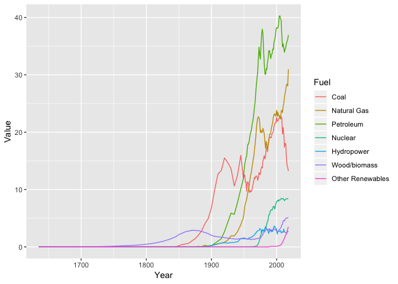

Using Python, create a plot of primary energy consumption (Quadrillion) versus time from 1635 -2017.

In base R, you can read in data as "dataframes" very easily. However, I would like to get you all in the habit of using "data tables" from the "data.table" library. It's great for later on (should you continue to use R for data analysis) when you will likely encounter larger datasets. Data tables are much more time-efficient to process on than dataframes.

First, let's install the package:

```r
# install.packages("data.table")
```
Then, we can load the data.table library:

```r
library(data.table)
```

## Read in CSV file


```r
df_data = fread('data/Primary Energy Consumption_from 1635.csv', skip = 2)
```

Click on the *df_data* object in your work environment to view the entire data table, or run the following code to see the "head" (first 6 rows) of the data table:

```r
head(df_data)
```

```
##      V1 Coal Natural Gas Petroleum Total Fossil Nuclear Hydropower
## 1: 1635    0          NA        NA            0      NA         NA
## 2: 1645   NA          NA        NA            0      NA         NA
## 3: 1655   NA          NA        NA            0      NA         NA
## 4: 1665   NA          NA        NA            0      NA         NA
## 5: 1675   NA          NA        NA            0      NA         NA
## 6: 1685   NA          NA        NA            0      NA         NA
##    Wood/biomass Solar Wind Total Renewable Energy
## 1:           NA    NA   NA                  0.000
## 2:        0.001    NA   NA                  0.001
## 3:        0.002    NA   NA                  0.002
## 4:        0.005    NA   NA                  0.005
## 5:        0.007    NA   NA                  0.007
## 6:        0.009    NA   NA                  0.009
```

## Rename year column

The first column, which includes the years, was not assigned a column name since the CSV file does not have a column name in that cell. So, we can manually change the first column as such:

```r
colnames(df_data)[1] = 'Year'
head(df_data)
```

```
##    Year Coal Natural Gas Petroleum Total Fossil Nuclear Hydropower
## 1: 1635    0          NA        NA            0      NA         NA
## 2: 1645   NA          NA        NA            0      NA         NA
## 3: 1655   NA          NA        NA            0      NA         NA
## 4: 1665   NA          NA        NA            0      NA         NA
## 5: 1675   NA          NA        NA            0      NA         NA
## 6: 1685   NA          NA        NA            0      NA         NA
##    Wood/biomass Solar Wind Total Renewable Energy
## 1:           NA    NA   NA                  0.000
## 2:        0.001    NA   NA                  0.001
## 3:        0.002    NA   NA                  0.002
## 4:        0.005    NA   NA                  0.005
## 5:        0.007    NA   NA                  0.007
## 6:        0.009    NA   NA                  0.009
```

## Fill NA values

There are a lot of records that are null (NA). Let's set these as equal to zero:

```r
df_data[is.na(df_data)] = 0 
```

## Create new column that's a sum of other columns

Let's create a new column titled 'Other Renewables' that is a sum of Solar and Wind fuel consumption.

```r
df_data[, 'Other Renewables' := Solar + Wind]
head(df_data)
```

```
##    Year Coal Natural Gas Petroleum Total Fossil Nuclear Hydropower
## 1: 1635    0           0         0            0       0          0
## 2: 1645    0           0         0            0       0          0
## 3: 1655    0           0         0            0       0          0
## 4: 1665    0           0         0            0       0          0
## 5: 1675    0           0         0            0       0          0
## 6: 1685    0           0         0            0       0          0
##    Wood/biomass Solar Wind Total Renewable Energy Other Renewables
## 1:        0.000     0    0                  0.000                0
## 2:        0.001     0    0                  0.001                0
## 3:        0.002     0    0                  0.002                0
## 4:        0.005     0    0                  0.005                0
## 5:        0.007     0    0                  0.007                0
## 6:        0.009     0    0                  0.009                0
```

## Transform data

When plotting a time series of categorical data, it's often easiest to have your data in a "long" format instead of a "wide" format (like above). So, this next step will transform your data so that all the values for the different fuel types will be put into a single column. Another column labeled "Fuel" will specify the type of fuel.


```r
df_long = melt(df_data, id.vars = "Year", measure.vars = c(2:12),
               variable.name = "Fuel", value.name = "Value")
head(df_long)
```

```
##    Year Fuel Value
## 1: 1635 Coal     0
## 2: 1645 Coal     0
## 3: 1655 Coal     0
## 4: 1665 Coal     0
## 5: 1675 Coal     0
## 6: 1685 Coal     0
```

## Remove certain variables 

Let's remove rows where the fuel are the totals ("Total Fossil", "Total Renewable Energy") as well as "Solar" and "Wind" since they're already included in the "Other Renewables" variable. 
The *%in%* selects all rows where the "Fuel" column included in the vector *c("Total Fossil", "Total Renewable Energy", "Solar", "Wind")*. The exclamation point (!) is equivalent to a *not* in the code. Thus, the code is actually selecting all rows where the fuel does NOT equal the listed fuels: 

```r
df_fuels = df_long[! Fuel %in% c("Total Fossil", "Total Renewable Energy", "Solar", "Wind")]
```

Alternatively, you can specify the rows with the fuel types you **do** want to keep:

```r
df_fuels = df_long[ Fuel %in% c("Coal", "Natural Gas", "Petroleum", "Nuclear", "Hydropower", "Wood/biomass", "Other Renewables")]
```
You can see that the resulting data table are the same either way.

## Plot

### Load ggplot
*ggplot* is a very popular package in R used to create plots. It's incredible versatile and flexible, and we'll be using the package to create the plot.
First, let's install the package:

```r
# install.packages("ggplot2")
```


```r
library(ggplot2)
```
### Rough plotting

```r
lplot = ggplot(data = df_fuels, aes(x = Year, y = Value, color = Fuel, fill = Fuel)) + geom_line()
lplot
```

<!-- -->


